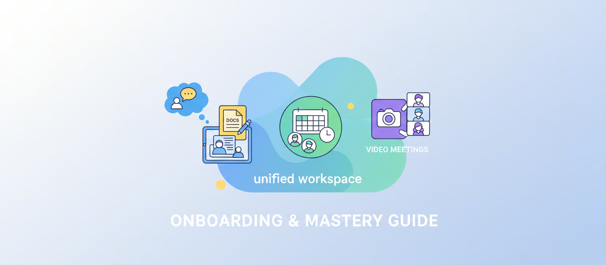
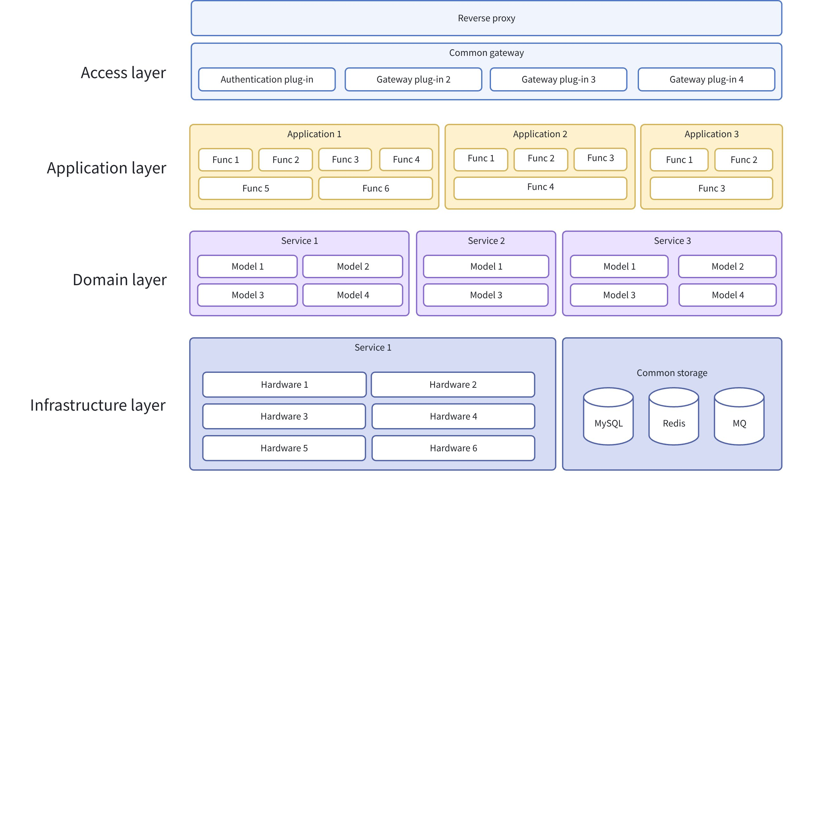
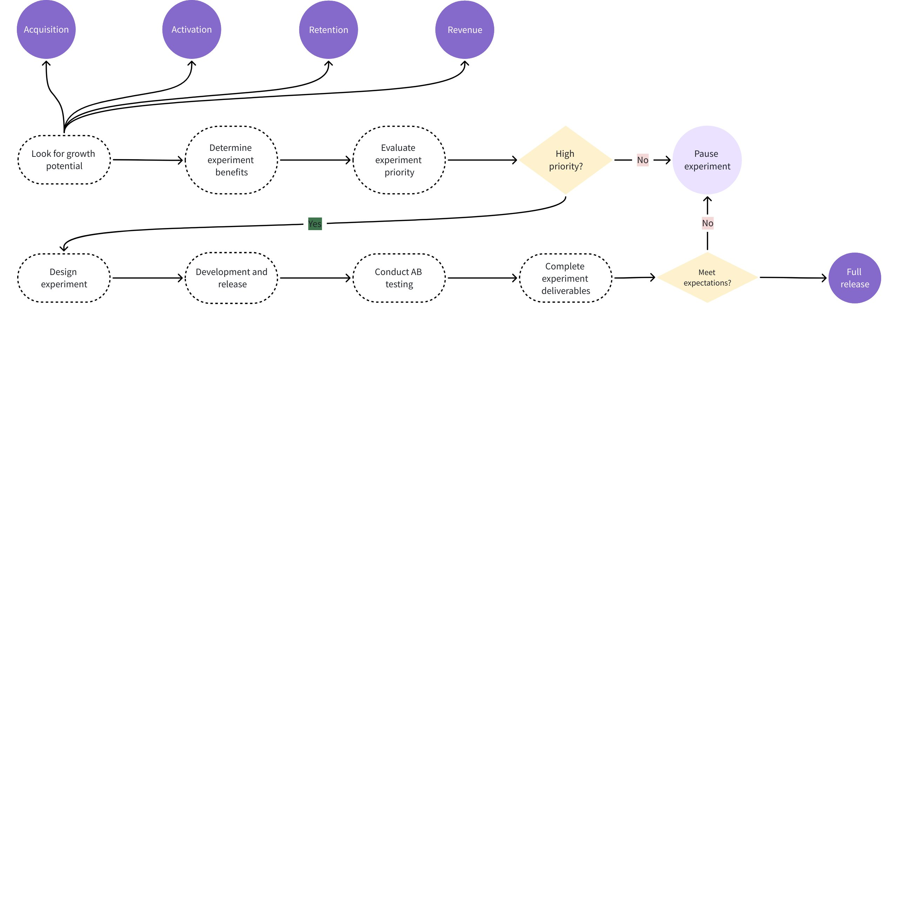
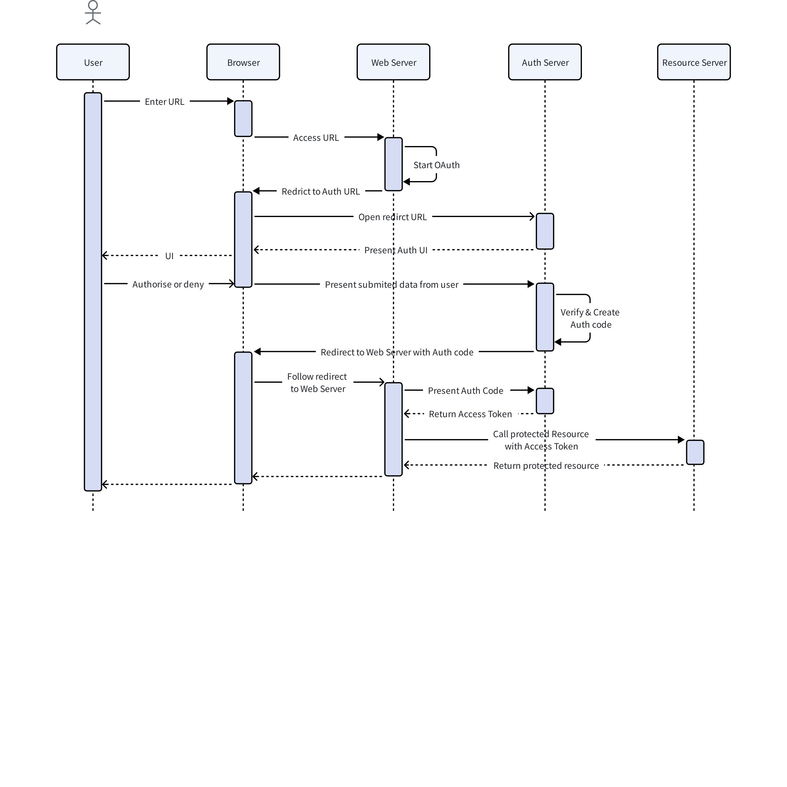
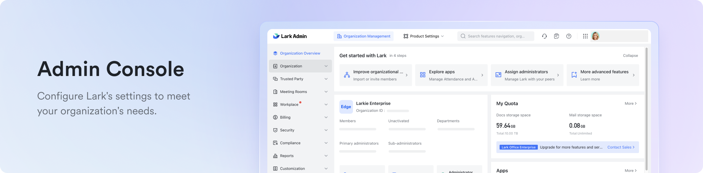
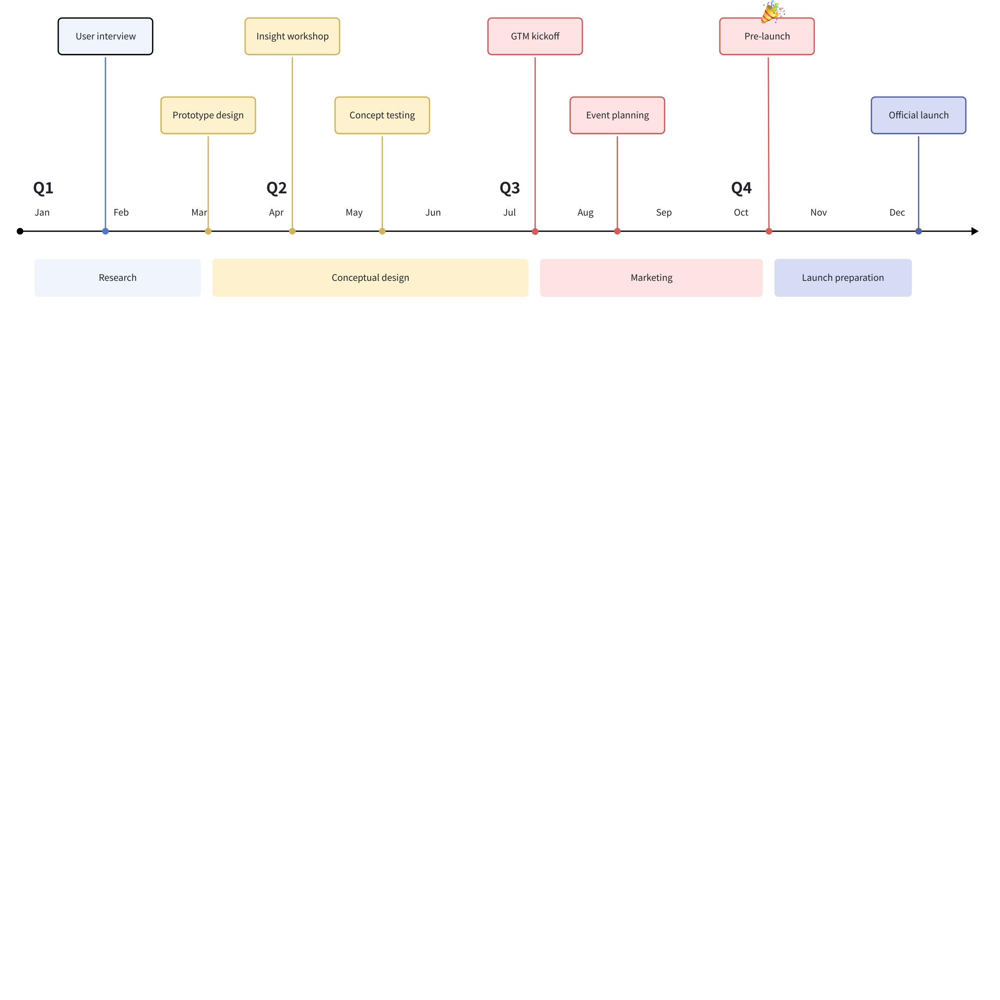

#+title: Getting Started with Lark: A Comprehensive Guide
#+lark_doc_id: AbYTw8kFDiHbRwkocEejEBuNpcc
#+lark_source: https://fjppwv7w873f.jp.larksuite.com/wiki/AbYTw8kFDiHbRwkocEejEBuNpcc
#+created_by: org-lark

#+attr_org: :token BrbhbtlkkozZlQxpWWajQxs5pbg :width 1536 :height 672 :align center

** Welcome to Lark: Your Digital Workspace
:PROPERTIES:
:CUSTOM_ID: welcome-to-lark-your-digital-workspace
:END:
This guide will walk you through the essentials of setting up and using Lark. Whether you're a new user or an administrator, you'll find everything you need to get started.

--------------

*** Section 1: Getting Your Account Ready
:PROPERTIES:
:CUSTOM_ID: section-1-getting-your-account-ready
:END:
The first step is to get your account set up and your applications installed. This section covers creating your account, joining a team, and downloading the Lark apps.

#+attr_org: :cols 2
#+begin_lark_grid
#+attr_org: :width 50
#+begin_lark_column
 #### 1.1 Account Creation & Sign-in - *Create a new workspace*: If you are setting up Lark for your team, you can create a new organization. - *Join an existing workspace*: If your team is already on Lark, you can join using an invitation link or by signing in with your work email. 
#+end_lark_column
 #+attr_org: :width 50
#+begin_lark_column
 #### 1.2 Download Lark Apps Lark is available on all your devices. Download the apps to stay connected wherever you are. - *Desktop*: macOS & Windows - *Mobile*: iOS & Android 
#+end_lark_column

#+end_lark_grid

#+attr_org: :emoji 💡 :background-color light-yellow :border-color light-yellow
#+begin_example

*Tip:* Complete your profile with a photo and contact information. This helps your colleagues get to know you! 
#+end_example

**** Onboarding Checklist
:PROPERTIES:
:CUSTOM_ID: onboarding-checklist
:END:
- [ ] Create or join a Lark workspace.
- [ ] Download the Lark desktop and mobile apps.
- [ ] Log in with your new account.
- [ ] Update your profile picture and details.

--------------

*** Section 2: Master the Core Features
:PROPERTIES:
:CUSTOM_ID: section-2-master-the-core-features
:END:
Lark integrates messaging, meetings, documents, and more into a single platform. Here's a look at the core components.

**** 2.1 The Lark Ecosystem
:PROPERTIES:
:CUSTOM_ID: 21-the-lark-ecosystem
:END:
This diagram shows how Lark's core features connect to create a seamless workflow.

#+attr_org: :token EfJWwxplHh9qXYbDId7j97ufpGc

**** 2.2 Onboarding Process Flow
:PROPERTIES:
:CUSTOM_ID: 22-onboarding-process-flow
:END:
Follow this flowchart to understand the typical journey of a new Lark user.

#+attr_org: :token LV5qwWVWxhMsjlbLS46jUw5apgd

--------------

*** Section 3: Communicate Effectively
:PROPERTIES:
:CUSTOM_ID: section-3-communicate-effectively
:END:
Clear and efficient communication is at the heart of Lark. Learn how to use Messenger and Meetings to connect with your team.

#+attr_org: :cols 2
#+begin_lark_grid
#+attr_org: :width 50
#+begin_lark_column
 #### 3.1 Messenger: Chats and Contacts - *Chats*: Start 1-on-1 chats, create group chats for projects or teams, and use threads to keep conversations organized. - *Rich Content*: Share files, images, code snippets, and even polls directly in your chats. - *Urgent Alerts*: Use the "Buzz" feature to send urgent messages that require immediate attention. 
#+end_lark_column
 #+attr_org: :width 50
#+begin_lark_column
 #### 3.2 Meetings: Video Conferencing Made Easy - *Schedule & Join*: Schedule meetings directly from your Calendar or start an instant meeting from a chat. - *Magic Share*: Share documents and screens with ease. - *Minutes & Recording*: Automatically transcribe meetings into editable minutes and record sessions for later review. 
#+end_lark_column

#+end_lark_grid

**** Meeting Scheduling Sequence
:PROPERTIES:
:CUSTOM_ID: meeting-scheduling-sequence
:END:
Here is the typical flow for scheduling a meeting in Lark:

#+attr_org: :token YbI8wHMlbhRxHRbBppkj4Clopmg

#+attr_org: :emoji speech_balloon :background-color light-blue :border-color light-blue
#+begin_example

*Best Practice:* Use threads to reply to specific messages in group chats. This keeps the main channel clean and easy to read. 
#+end_example

--------------

*** Section 4: Collaborate on Documents and Projects
:PROPERTIES:
:CUSTOM_ID: section-4-collaborate-on-documents-and-projects
:END:
Lark's collaboration suite allows you to create, share, and manage your work in one place.

**** 4.1 Docs, Sheets, and Whiteboards
:PROPERTIES:
:CUSTOM_ID: 41-docs-sheets-and-whiteboards
:END:
| **Tool** | **Best For** | **Key Features** |
|-
| **Docs** | Creating documents, wikis, and notes | - Real-time co-editing - Rich content (images, tables, checklists) - Version history |
| **Sheets** | Data analysis and spreadsheets | - Powerful formulas and functions - Pivot tables and charts - Conditional formatting |
| **Whiteboard** | Brainstorming and visual collaboration | - Infinite canvas - Pre-built templates - Real-time drawing and sticky notes |

**** 4.2 Lark Drive: Your Cloud Storage
:PROPERTIES:
:CUSTOM_ID: 42-lark-drive-your-cloud-storage
:END:
- *Centralized Storage*: Store all your files securely in the cloud.
- *Easy Sharing*: Share files and folders with specific permissions (view, comment, or edit).
- *Offline Access*: Sync files to your desktop for offline access.

#+begin_quote

"Lark Drive is the single source of truth for all our project files. It keeps everyone on the same page." 
#+end_quote

--------------

*** Section 5: Plan Your Time with Calendar and Tasks
:PROPERTIES:
:CUSTOM_ID: section-5-plan-your-time-with-calendar-and-tasks
:END:
Manage your schedule, book meetings, and track your to-dos with Lark's integrated calendar and task management tools.

**** 5.1 Calendar: Manage Your Schedule
:PROPERTIES:
:CUSTOM_ID: 51-calendar-manage-your-schedule
:END:
- *Personal & Team Calendars*: View your own schedule and subscribe to team calendars to see colleagues' availability.
- *Meeting Rooms*: Book meeting rooms directly from the calendar event.
- *External Sharing*: Share your availability with external partners to find a meeting time that works for everyone.

**** First Week Onboarding Plan
:PROPERTIES:
:CUSTOM_ID: first-week-onboarding-plan
:END:
This Gantt chart provides a sample plan for your first week using Lark.

--------------

*** Section 6: Advanced Features and Customization
:PROPERTIES:
:CUSTOM_ID: section-6-advanced-features-and-customization
:END:
Once you're comfortable with the basics, explore these advanced features to make Lark work even better for you.

#+attr_org: :cols 2
#+begin_lark_grid
#+attr_org: :width 50
#+begin_lark_column
 #### 6.1 Workplace & App Directory - *Workplace*: A customizable dashboard for quick access to your most-used apps and tools. - *App Directory*: Discover and add third-party applications to extend Lark's functionality. 
#+end_lark_column
 #+attr_org: :width 50
#+begin_lark_column
 #### 6.2 Slash Commands Boost your efficiency with slash commands. Type =/= in any chat to see a list of available commands. #+attr_org: :token N1HLbC4Gpotj3xxdfKNjTdAfp1c :width 2272 :height 560 :align center

#+end_lark_column

#+end_lark_grid

The following is a project timeline chart.

#+attr_org: :token Sdrww7n9ahDG0ZboCqUjvBmxped

#+begin_src go
package main

import (
        "encoding/json"
        "fmt"
        "net/http"
)

type Post struct {
        Title string `json:"title"`
}

func main() {
        resp, err := http.Get("https://jsonplaceholder.typicode.com/posts/1")
        if err != nil {
                panic(err)
        }
        defer resp.Body.Close()

        var post Post
        if err := json.NewDecoder(resp.Body).Decode(&post); err != nil {
                panic(err)
        }

        fmt.Println("Title:", post.Title)
}
#+end_src

#+begin_src rust
use reqwest::Error;
use serde::Deserialize;

#[derive(Deserialize)]
struct Post {
    title: String,
}

#[tokio::main]
async fn main() -> Result<(), Error> {
    let resp = reqwest::get("https://jsonplaceholder.typicode.com/posts/1")
        .await?
        .json::<Post>()
        .await?;

    println!("Title: {}", resp.title);
    Ok(())
}
#+end_src

--------------

*** Section 7: User Adoption and Growth
:PROPERTIES:
:CUSTOM_ID: section-7-user-adoption-and-growth
:END:
This interactive chart shows a typical user adoption curve for a new team starting with Lark.

[[https://www.youtube.com/watch?v=th8u0bqYsQk][Lark iframe]]

#+attr_org: :emoji ⭐ :background-color light-green :border-color light-green
#+begin_example

*Congratulations!* You've completed the Lark Getting Started guide. You're now ready to collaborate effectively with your team. 
#+end_example
